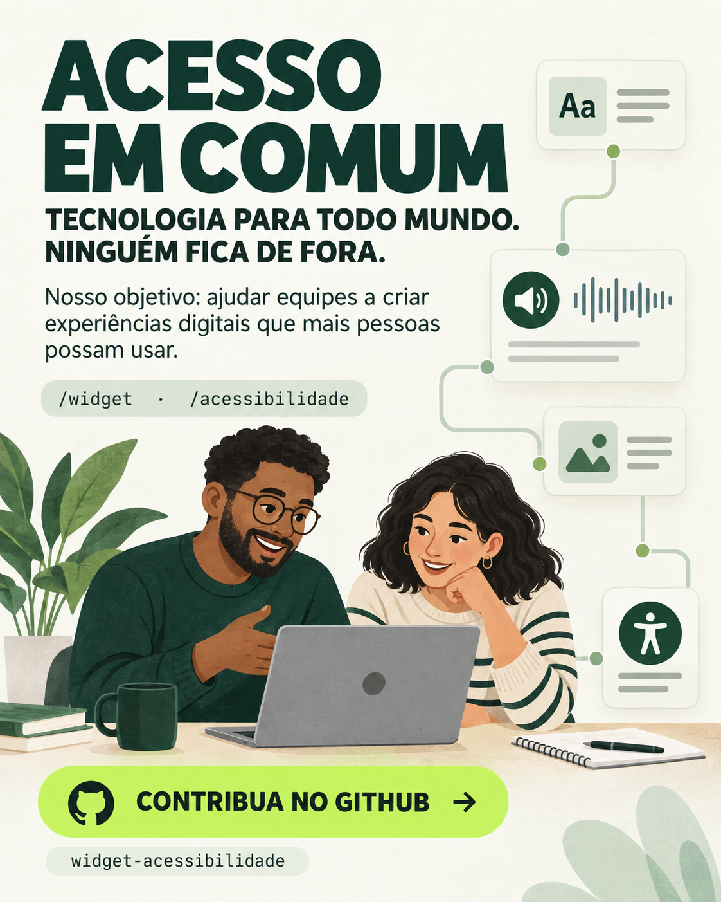

# Material de divulgação

## Texto para compartilhar

Estou construindo o **Acesso em Comum**, um projeto que nasceu no Hackaton Skip com uma pergunta: como tornar os sistemas digitais mais acessíveis e fáceis de usar?

Ele reúne duas ferramentas gratuitas:

- **/widget** mapeia telas e ações para ajudar as pessoas a encontrar caminhos dentro de uma aplicação.
- **/acessibilidade** analisa barreiras e organiza achados com evidências e sugestões de melhoria.

O objetivo é ajudar equipes a criar experiências digitais que mais pessoas possam usar, com autonomia. Quero aproximar desenvolvedores, pessoas com deficiência e comunidade para testar, compartilhar experiências e construir melhorias juntos.

O projeto está aberto à colaboração. Feedback, ideias, documentação, testes e contribuições de código ajudam a levar essa iniciativa adiante.

**Conheça e contribua no GitHub:** <https://github.com/nicollasarcanjo/widget-acessibilidade>

O uso integrado em produtos e serviços monetizados é permitido. A restrição é não vender ou cobrar separadamente pelo widget como produto independente; veja os termos em [`LICENSE`](LICENSE).
