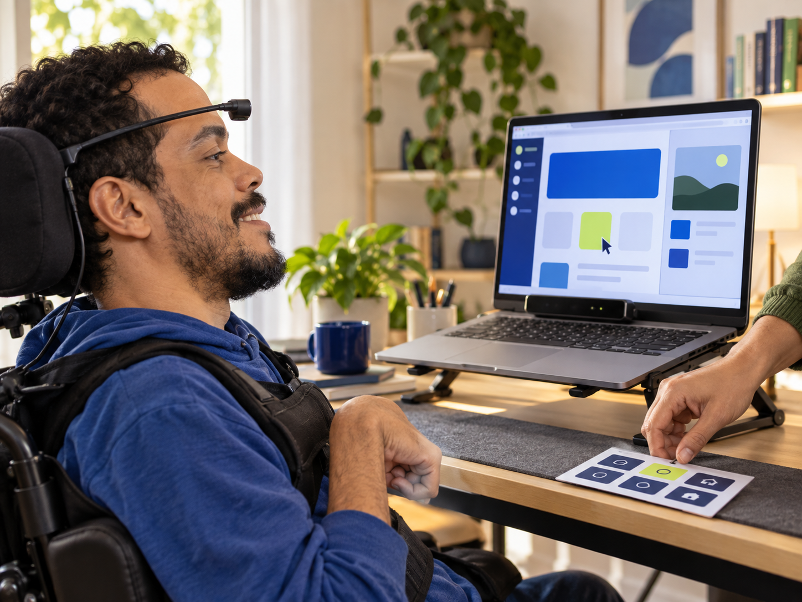

<div align="center">
  
  <h1>Skip Acessibilidade</h1>
  <p><strong>Ferramentas para criar experiências digitais em que ninguém fica de fora.</strong></p>
  <p>Skills do Codex · mapa de telas · widget assistivo · auditoria com evidências</p>
</div>

<p align="center">
  <a href="#-widget">/widget</a> · <a href="#-acessibilidade">/acessibilidade</a> · <a href="#instalação">Instalação</a> · <a href="#licença">Licença</a>
</p>

## Objetivo

O projeto ajuda equipes a enxergar e reduzir barreiras em aplicações web. Ele reúne duas ferramentas que podem ser usadas separadamente: uma integra um widget assistivo com contexto sobre as telas do próprio app; a outra examina a acessibilidade do produto e entrega um relatório priorizado para a equipe corrigir.

A ideia nasceu no **Hackaton Skip**: tornar aplicações mais fáceis de entender e usar sem tirar autonomia das pessoas. O projeto começou como um widget e evoluiu para incluir o mapa das interfaces, navegação por objetivo e uma auditoria de acessibilidade com evidências.

<p align="center">
  
</p>

## As ferramentas

### `/widget` — encontre seu caminho pelo app

Analisa um projeto web específico e acrescenta o widget assistivo ao layout da aplicação. O scanner baseado nos princípios do Graphify identifica rotas, telas, controles, rótulos e destinos conhecidos; o mapa resultante dá contexto à navegação por objetivo.

- Gera evidências locais em `.graph-scanner/` e um mapa de telas em `public/widget-screen-map.json`.
- Integra recursos de voz, leitura em voz alta, preferências visuais e navegação entre telas.
- Mantém a navegação automática restrita a destinos conhecidos e controles identificados como navegação; não submete formulários.
- Pode complementar a análise de código com captura autenticada do DOM usando a extensão Chrome incluída.

### `/acessibilidade` — descubra o que pode melhorar

Avalia o projeto atual segundo os critérios aplicáveis da **WCAG 2.2 níveis A e AA** e produz um relatório com evidências, prioridades e sugestões de correção. A auditoria também considera referências brasileiras quando o contexto do produto justificar.

- Salva o relatório em `docs/accessibility/audit-AAAA-MM-DD.md`.
- Diferencia análise de código, execução de axe e verificação manual.
- Não modifica o código do produto nem instala um widget para substituir correções estruturais.
- Registra as páginas e estados não avaliados; não declara conformidade quando a cobertura é incompleta.

As duas skills podem ser usadas no mesmo projeto, mas têm objetivos distintos: `/widget` integra assistência e navegação; `/acessibilidade` audita e recomenda correções.

## Como o projeto chegou até aqui

1. **Hackaton Skip — a ideia:** facilitar o uso de sistemas web para pessoas com diferentes formas de perceber, navegar e interagir.
2. **Um widget com contexto:** em vez de depender somente de nomes de botões, o projeto começou a mapear as telas e os controles da aplicação.
3. **Scanner de telas:** a estrutura de grafo inspirada no Graphify virou um scanner próprio para rotas, ações e destinos conhecidos, executado dentro do projeto-alvo.
4. **Navegação e voz:** leitura em voz alta, preferências visuais, comandos por voz e caminhos entre telas passaram a fazer parte da experiência.
5. **Auditoria de acessibilidade:** surgiu `/acessibilidade`, para transformar achados em um relatório rastreável e priorizado.
6. **O próximo trecho:** ampliar a captura de diálogos e estados dinâmicos, deixar a orientação visual mais clara, tornar a voz mais rápida e validar o produto com mais pessoas e tecnologias assistivas.

## Instalação

Clone o repositório e instale as duas pastas de skill no Codex:

```powershell
git clone https://github.com/nicollasarcanjo/widget-acessibilidade.git
Set-Location .\widget-acessibilidade
$skills = Join-Path $env:USERPROFILE ".codex\skills"
New-Item -ItemType Directory -Force $skills | Out-Null
Copy-Item -Recurse -Force .\widget (Join-Path $skills "widget")
Copy-Item -Recurse -Force .\acessibilidade (Join-Path $skills "acessibilidade")
```

Reinicie ou atualize o Codex. No projeto desejado, use `/widget` para integrar o widget, ou `/acessibilidade` para produzir a auditoria. Revise o plano e o relatório com a equipe e teste fluxos relevantes com pessoas e tecnologias assistivas.

## Scanner local

O scanner vem incluído; não precisa instalar outro pacote npm nem executar `npx`:

```bash
node widget/scripts/scan-project.mjs <caminho-do-projeto>
```

Requisitos: Node.js 20+, Python 3.10+ e `uv`. O scanner prepara o runtime Python quando necessário. A execução da skill usa `--dry-run`; o código e o mapa ficam no projeto local e não são enviados ao serviço multi-projeto.

## Desenvolvimento e verificações

```bash
npm test
python -m pip install uv "networkx>=3.4,<4" "tree-sitter>=0.23,<0.26" "tree-sitter-typescript>=0.23,<0.25" "tree-sitter-javascript>=0.23,<0.26"
python widget/assets/graph-scanner/test/scanner.test.py
```

Pull requests e pushes executam verificações automatizadas das skills, do scanner e da extensão Chrome.

## Licença e contribuições

O desenvolvimento e as contribuições são públicos. O código original do projeto é gratuito para usos não comerciais permitidos pela **PolyForm Noncommercial 1.0.0**. Uso comercial ou monetização não são permitidos sem autorização escrita do titular. Essa licença não é aprovada pela OSI como licença open source; consulte [`LICENSE`](LICENSE) antes de reutilizar.

O scanner contém componentes de terceiros, incluindo Graphify e axe-core, cada um com seus próprios avisos e licenças. Eles permanecem em `widget/assets/graph-scanner/`; a licença deste projeto não substitui as licenças desses componentes.

Sugestões, relatos de uso, correções de documentação, traduções e pull requests são bem-vindos. Ao contribuir, descreva o problema, o comportamento esperado e como a mudança pode ser verificada.

## Divulgue o projeto

O card e um texto pronto para compartilhar estão em [`DIVULGACAO.md`](DIVULGACAO.md).

## Links

- Repositório e issues: <https://github.com/nicollasarcanjo/widget-acessibilidade>
- Portfólio: <https://nicollas.heso.com.br>
